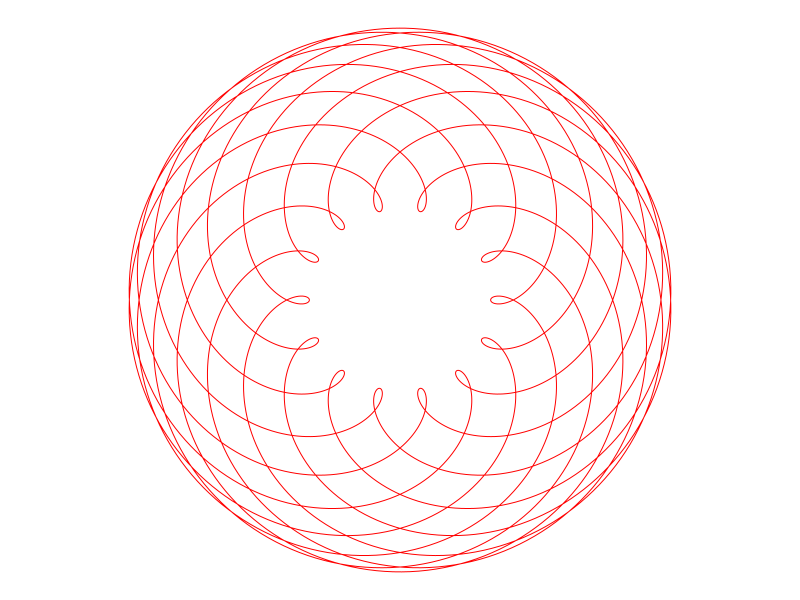
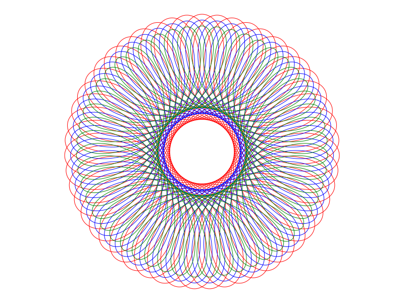

# Spirograph
Julia implementation of the classic [Spirograph](https://en.wikipedia.org/wiki/Spirograph) toy.


## Creating Spirograph Drawings

To make a spirograph drawing, use the function
```julia
spirograph(a,b,offset,args...)
```
where
+ `a` is the radius of the fixed wheel,
+ `b` is the radius of the moving wheel, and
+ `offset` is the distance from the center of the moving wheel to the pen location.

Here `a` and `b` are integers. The argument `b` may be negative, in which case the moving wheel glides along the inside of the fixed wheel. This is shown in the following diagram in which the red dot shows the pen location.


### Drawing Options

The optional `args` can be used to change aspects of the plot.

For example:
```julia
spirograph(25,11,18,linecolor=:red)
```
produces this image:



### Combining Drawings

We also provide the function `spirograph!` that operates exactly like `spirograph` but does not first clear the drawing window. In this way, multiple spirograph images can be combined.

```julia
julia> spirograph(40,-11,18,linecolor=:red)

julia> spirograph!(40,-11,16,linecolor=:blue)

julia> spirograph!(40,-11,14,linecolor=:green)
```



## Saving

To save an image, use the `savefig` function from [Plots](http://docs.juliaplots.org/latest/). For example:
```julia
julia> using Spirograph, Plots

julia> spirograph(80,33,45,linewidth=0.5)

julia> savefig("my-spiro.pdf")
```

[Click here](my-spiro.pdf) to see the result. 